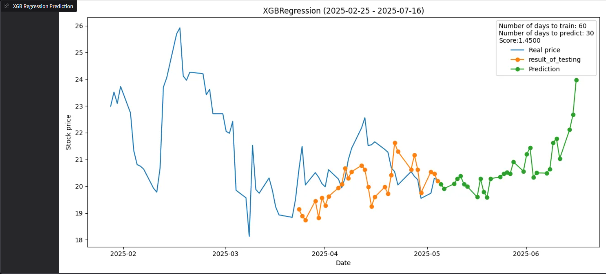
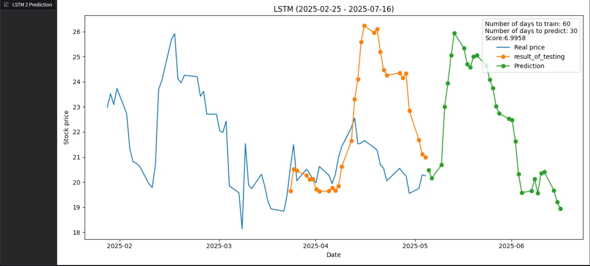

# AI Share Price Prediction 🚀📈

A project that uses machine learning to predict stock prices.

## 📋 Prerequisites

- Python 3.11 (other versions may cause problems)
- pip (latest version)
- Required packages (installation script will install them)

## 🛠️ Installation


```bash
git clone https://github.com/toniejatoty/AI_share_prediction
cd AI_share_prediction
python -m pip install --upgrade pip
pip install -r requirements.txt
python app.py
```
## Description
User can provide wide arguments like: 
- ticker (Program uses yahoo finance so ticker must be aviable on yfinance) 
- Days to predict
- Start date (date since when model is trained and tested)
- Days to train Loss function

It predicts Close price in 4 models
- Linear Regressor
- XGBRegressor
- LSTM v1
- LSTM v2
  
  In XGB and LSTM user can give additional parameters to get better score

  On the output are:

  - Status (feedback from all the models) 
  - Historical graph
  - Linear graph
  - XGBRegressor graph
  - LSTM v1 graph
  - LSTM v2 graph
  
## LINEAR Regression
It is as fast that it will find the best number of days to train to get the best results. So it is looking for those parameters to get result of prediction on testing and prediction in order to visualizate on graph.
## XGBREGRESSOR
It split data that train=80%, test=20%. To get more than 1 prediction it uses the same number of models as user want to number of days will be predicted. So each model is according to get prediction on each day

## LSTM v1 and v2
The are 2 implementation of LSTM. The first is trained to in one prediction give all the days. The second is trained to give one day predicted. To get more days this predicted day is throwing away the oldest record and this predicted is becomes the latest. In first implementation train=80%, test=20%, in second test=1 record, train=rest of records. Parameters provided by user in GUI in LSTM section are for both of implementation

## 🖥️ System Demonstration
Example graph of LSTM v2 implementation


All the parameters that user can give

## 📂 Documentation

[📄 Full documentation in Polish](projekt_indywidualny.pdf)